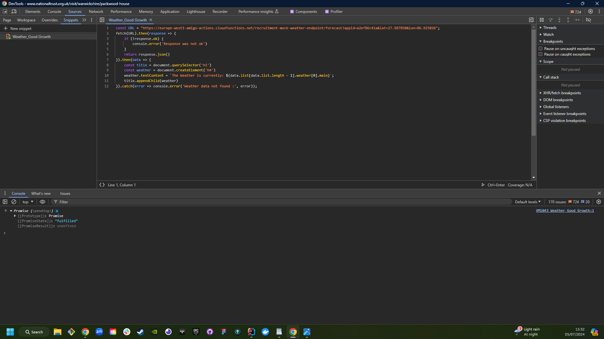
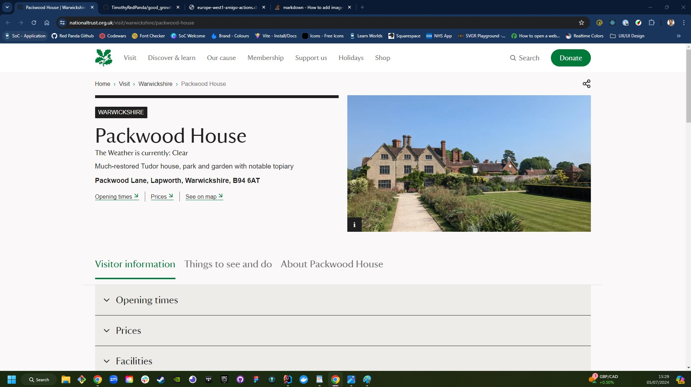

# Good Growth
Tech Test for GoodGrowth: Displaying Weather on a Pre-made Page Using JavaScript

## Future Improvements
* The National Trust's website sends network requests to get information about the property on each page. This could be used to gather property-specific data for our API call.
* Currently, the API call is hardcoded. To make this more viable for the National Trust, the API should be queried to return data for a specific location.
* A/B testing was not implemented in this version. Adding this feature would allow the National Trust to accurately gauge the performance impact.

## How Does It Work? (For Non-Technical Readers)
To display our data on the page, we need two things:
access to the correct data and access to the page where we want to display it.

To access the data, we make what's called a `fetch` request to a `URL`.
This is similar to what your browser does every day when you visit a webpage.
You give the browser an address, and it responds by displaying the web page.
As long as you ask the right question, you can get the right answer.

Let's walk through the process step by step:

1. We start by making a `fetch` request to our `URL`.
2. We then check if the response we get is `ok`.
3. If the response is `ok`, we return the `data`.

Now that we have our `data`, how do we access different items within it?
The data is in a JSON format, which you can think of as a box of items.

This line accesses specific information in our JSON object:

`data.list[data.list.length -1].weather[0].main`

We take the `data` and look for an item called `list`.
We then look at the last items inside `list`, find the `weather` item within it,
and finally access the `main` property of the first weather item (remember, arrays/lists start at zero, not one).

The code then creates a title element (`h4`) and adds it to the National Trust's page title (`h1`).
It sets the `textContent` of the `h4` to be the string
(think of this as a sequence of letters or text, like "Hi GoodGrowth") it found at the specified position in the `data`.

In simplest terms,
we're asking the browser to find a specific item in a list
and then write it down underneath the title of the page you're on.

Finally, the `.catch` at the end is catching any errors.
This means if no `data` is return we will get an error telling
us why.

